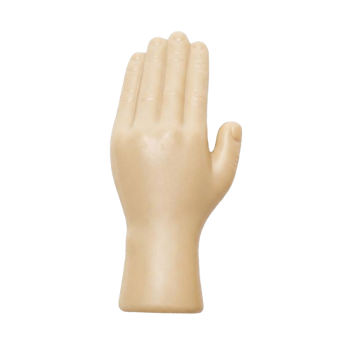

# ✋ Hand Pointer Cursor

A Chrome extension that replaces your cursor with a comically large hand.

## How It Works

Click the extension icon to toggle your cursor between the default and a giant hand. Click again to toggle back.

## Install

1. Open `chrome://extensions`
2. Enable **Developer mode**
3. Click **Load unpacked** and select this folder

## Files

| File | Purpose |
|------|---------|
| `manifest.json` | Extension manifest (Manifest V3) |
| `background.js` | Service worker — handles toolbar icon click |
| `content.js` | Injected script — swaps the cursor via CSS |
| `images/hand-cursor.png` | 128×128 rotated hand cursor |
| `icons/` | Toolbar icons (48 & 128px) |
